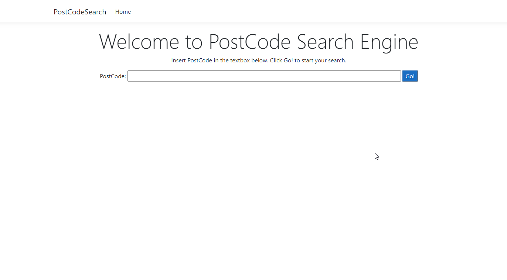
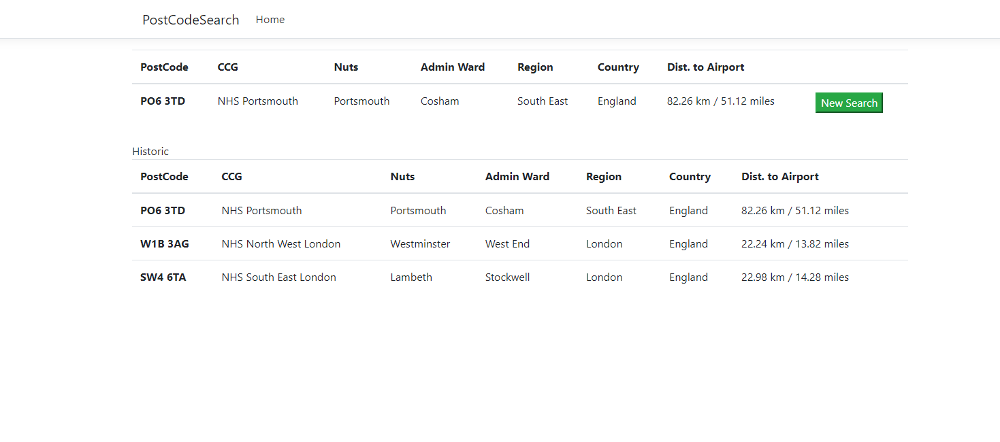

## Getting started

1 hour challenge

Tech:
- .NET Core
- Docker
- MongoDB
- http://api.postcodes.io
- Geolocation library

To run the solution and dependencies, run the following:
- Run `docker build -t craft-api -f Dockerfile .`
- Run `docker-compose up`

